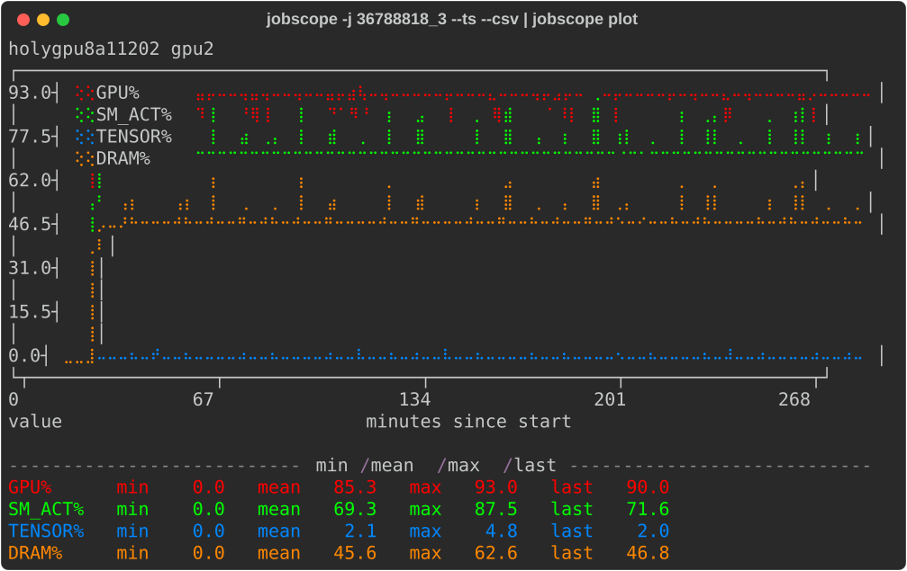
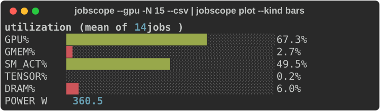

# jobscope

`jobscope` reports how efficiently Slurm jobs used the resources they requested. It
reads the CPU, memory, GPU, and GPU memory utilization already stored in each job's
`sacct` record, adds DCGM/Prometheus profiling metrics for GPU jobs, and can chart
the results in the terminal.

For completed jobs, the CPU/MEM/GPU/GMEM values match `jobstats`: jobscope decodes
the same stored data, but does it with one bulk `sacct` query instead of per-job
calls.

## What You Get

- CPU, memory, GPU, GPU memory, SM activity, tensor activity, DRAM activity, and
  power columns.
- Summary bands that count wasteful, borderline, and healthy jobs by metric.
- Problem-job lists that name the worst offenders in a selection.
- Per-GPU time-series CSV and terminal plots for deeper GPU debugging.

## Screenshots

<p>
  <strong>Per-job DCGM time series</strong><br>
  
</p>

<p>
  <strong>Aggregated utilization across jobs</strong><br>
  
</p>

## Install

`jobscope` needs Python 3.9+. The recommended install path is
[`uv`](https://docs.astral.sh/uv/), which can install its own Python and put the
`jobscope` command on your `PATH`.

```bash
curl -LsSf https://astral.sh/uv/install.sh | sh
uv tool install jobscope
```

Restart your shell if `uv` was just installed. Later:

```bash
uv tool upgrade jobscope
uv tool uninstall jobscope
```

Other ways to install `uv` include `pipx install uv`, `brew install uv`, and the
[uv installation docs](https://docs.astral.sh/uv/getting-started/installation/).

## First-Time Cluster Setup

If your cluster does not already have a jobscope config, run:

```bash
jobscope probe
jobscope probe --init
```

`probe` checks what Slurm and Prometheus expose. `probe --init` writes a config from
those findings and refuses to overwrite an existing one. Site setup details are in
[docs/admin.md](docs/admin.md).

## Quick Start

| command | use |
|---|---|
| `jobscope` | your running jobs |
| `jobscope 36770231` | one running or finished job |
| `jobscope -j 36770231 -j 36770232` | several explicit jobs |
| `jobscope finished -N 20` | your most recent 20 completed jobs |
| `jobscope finished -p kempner_h100 -D 1` | your completed jobs in one partition |
| `jobscope -j 36788818_3 --plot-ts` | chart one job over time, a panel per metric |
| `jobscope -j 36788818_3 --plot-ts-overlay` | the same series overlaid, a panel per GPU |

Without a mode word, `jobscope` shows jobs running now. Use `finished` for history.
Selections are scoped to your user by default; add `-a` to include all users.

## Reading a Report

```bash
jobscope -j 36770231
```

Typical output has three parts:

- The job table shows one row per job. Percent columns are average utilization over
  the selected allocation.
- `Summary by metric` pools the selection. `USED` is resource-time that did work and
  its share of the allocation, such as GPU-hours used out of GPU-hours requested.
- `Problem jobs` appears for multi-job selections and lists the jobs that crossed
  configured waste thresholds.

On a real terminal, utilization cells are tinted by band. The plain text still shows
the same numbers, but not the color. Run `jobscope describe` for column definitions,
or see [docs/reference.md](docs/reference.md) for every flag, column, band, and plot
layout.

## Finished Jobs and Dates

```bash
jobscope finished -D 3
jobscope finished -N 20
jobscope finished -S 2026-08-01
jobscope finished -S 2026-07-30 -E 2026-08-01
jobscope finished -t failed
```

Date and state notes:

- `-D N` selects the last `N` days. The default for `finished` is one day.
- `-N N` selects the most recent `N` jobs and looks back as far as needed.
- `-S YYYY-MM-DD` by itself means that calendar day, not "since then".
- Add `-E` to make an explicit window.
- `-t` defaults to completed jobs. Use `failed`, `timeout`, `cancelled`, or `all` to
  include other endings.

Every report header restates the actual window scanned, so saved output is
self-contained.

## Narrow to Nodes or GPUs

Multi-node jobs can hide uneven work because the default row averages across the
whole allocation. Narrow the report when you need to inspect placement.

```bash
jobscope -j 36770231 --nodename holygpu8a15401
jobscope -j 36770231 --nodename holygpu8a15401 --gpuid 0,1
jobscope -j 36770231 --per-gpu --nodename holygpu8a15401
```

`--nodename` recomputes the report for one node. `--gpuid` narrows to particular
cards; GPU ids are per node, so GPU 0 exists on every node in a multi-node job.
`--per-gpu` prints one row per GPU with absolute memory beside the percentages.

## Time-Series Views

Averages can hide whether a job used half a GPU throughout or all of a GPU for half
the run. Time-series output keeps the per-scrape shape.

```bash
jobscope -j 36788818_3 --ts | jobscope plot
jobscope -j 36788818_3 --plot-ts
jobscope -j 36788818_3 --plot-ts-overlay
jobscope -j 36788818_3 --plot-ts 30m
jobscope -j 36788818_3 --ts | jobscope plot --compact
```

`--ts` writes one row per GPU per scrape, as CSV. `jobscope plot` charts that stream.
`--plot-ts` does the same in one command, with one panel per metric. On multi-node
jobs, add `--nodename` so GPU ids from different nodes do not merge.

`--plot-ts-overlay` charts the same series the other way round: one panel per GPU with
every metric on a shared axis, and one row per node — so it needs no `--nodename`. Use
it to see whether metrics moved *together*, which is the question behind most
diagnosis: `GPU% 90` beside `SM_ACT% 8` on one pair of axes is a card that was occupied
but barely loaded. Watts are left out, because they cannot share a scale with
percentages. Each panel legends its own metrics; without colour the markers are
identical, so `--plot-ts` is the one to use then.

Useful companions:

- `--stats` summarizes a time window with min/mean/max/last per GPU and metric.
- `--eff` sorts jobs into efficiency categories.
- Array elements such as `36788818_3` can be passed directly.

## Fewer or More Columns

```bash
jobscope -j 36770231 --cpu
jobscope -j 36770231 --gpu
jobscope -j 36770231 --all-metrics
jobscope describe --all-metrics
```

`--cpu` prints only CPU and memory columns. For finished jobs it does not need
Prometheus, so it is the fastest wide query. `--gpu` prints the GPU side.
`--all-metrics` adds the full catalog, including clocks, temperatures, PCIe, and NVLink.

## Where the GPU numbers come from

Every column has its own source, and the header block names them:

```
  Source:    CPU% MEM% GPU% GMEM_GB GMEM_TOTAL_GB <- jobstats;  SM_ACT% TENSOR% DRAM% POWER_W <- dcgm
```

`CPU%`, `MEM%`, `GPU%` and GPU memory come from the jobstats record Slurm already
stored, which costs no query; the activity columns come from dcgm-exporter, which is
the only source that publishes them. To measure the first group instead of reading it
back:

```bash
jobscope -j 36770231 --gpu-source dcgm     # GPU% from DCGM_FI_DEV_GPU_UTIL
jobscope -j 36770231 --gpu-source nvml     # the nvidia exporter's own readings
```

Naming a source promotes it for the columns it can serve, so `--gpu-source dcgm` does
not drop GPU memory, which DCGM has no total for here. `--gpu-source nvml` does narrow
the table, because the nvidia exporter publishes no SM, tensor or DRAM activity at all.

A running job has no stored record — Slurm writes it at job end — so its numbers are
always measured, and the line says so: `CPU% MEM% <- cgroup;  GPU% ... <- dcgm`. A
column whose source has nothing prints `-`, which is how a cluster with no cgroup
exporter reads. Set the defaults with `[gpu] source` and `[host] source` (see
`jobscope config --example`).

## Documentation

| document | contents |
|---|---|
| [docs/reference.md](docs/reference.md) | all flags, columns, thresholds, and plot layouts |
| [docs/admin.md](docs/admin.md) | cluster setup, `probe`, Prometheus, and config |
| [docs/metrics.md](docs/metrics.md) | how metrics are measured and checked |
| [CHANGELOG.md](CHANGELOG.md) | release notes and CSV-affecting changes |

`jobscope --help` narrows the help to the command shape you are writing. Use
`jobscope --help-all` for every option.

## Contrib

`contrib/jobstats_extended.py` is a site-specific prototype that folds DCGM metrics
into the jobstats summary itself. It depends on an upstream jobstats install and is not
part of the package; see [contrib/README.md](contrib/README.md).

## References

- [FASRC jobstats documentation](https://docs.rc.fas.harvard.edu/kb/jobstats/)
- [Princeton jobstats](https://princetonuniversity.github.io/jobstats/)
- For live monitoring, use [KempnerPulse](https://github.com/KempnerInstitute/kempnerpulse)
